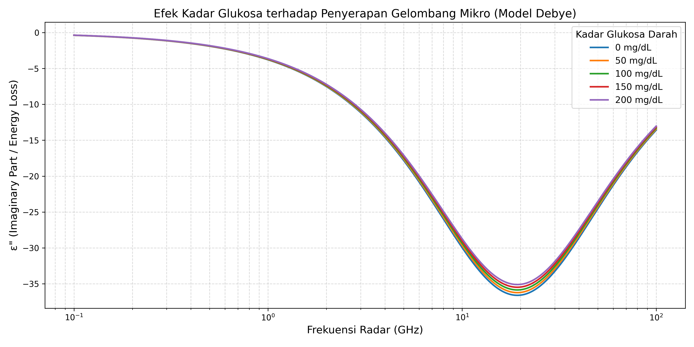

# 📡 Dielectric Radar: Non-Invasive Glucose Monitoring

> **Revolutionizing diabetes care through computational bio-electromagnetics**

[](https://www.python.org/)
[]()
[]()

---

## 🎯 Project Vision

Diabetes affects over **537 million adults worldwide**. Current glucose monitoring methods require invasive blood draws, causing discomfort and limiting frequent monitoring. This project explores a **groundbreaking alternative**: using millimeter-wave radar to detect blood glucose levels **non-invasively** by analyzing the dielectric properties of blood.

---

## 🔬 Scientific Foundation

### The Physics Behind It

Blood is primarily water, and water molecules are **electric dipoles** that rotate in response to electromagnetic fields. When glucose molecules bind to water through hydrogen bonding, they restrict this rotation, altering the blood's **complex permittivity** (dielectric constant).

Using the **Debye Relaxation Model**, we simulate how these microscopic changes manifest as measurable shifts in electromagnetic energy absorption at specific microwave frequencies.

### Key Discovery

Our simulations reveal that:
- **Peak dielectric loss** occurs at ~19.3 GHz for pure water
- Increasing glucose concentration (0 → 200 mg/dL) **decreases static permittivity** (εₛ)
- The resulting **Δε shift** is detectable by modern 60GHz FMCW radar sensors

---

## 📊 Phase 1: Digital Sandbox Simulation

### What We've Achieved

✅ **Computational Proof-of-Concept**: Validated that glucose-induced permittivity changes follow predictable Debye relaxation patterns

✅ **Frequency Identification**: Identified optimal detection frequency range (~10-20 GHz)

✅ **Quantifiable Signal**: Demonstrated measurable Δε between normal and diabetic glucose levels

### Simulation Results



*Figure 1: Imaginary part of complex permittivity vs. frequency for varying glucose concentrations. Note the systematic downward shift in peak absorption as glucose increases.*

---

## 🛠️ Technical Implementation

### Technology Stack

| Component | Technology | Purpose |
|-----------|-----------|---------|
| **Language** | Python 3.8+ | Core computation |
| **Numerical** | NumPy | Complex permittivity calculations |
| **Visualization** | Matplotlib | Scientific plotting |
| **Domain** | Bio-electromagnetics, DSP | Signal processing theory |

### Core Algorithm

The Debye model implementation:

```python
def debye_model(f, eps_s, eps_inf, tau):
    """
    Calculate complex permittivity using Debye relaxation model.
    
    ε*(ω) = ε_∞ + (ε_s - ε_∞) / (1 + jωτ)
    
    Parameters:
    - f: Frequency (Hz)
    - eps_s: Static permittivity
    - eps_inf: High-frequency permittivity  
    - tau: Relaxation time (s)
    
    Returns:
    - Complex permittivity ε*(ω)
    """
    omega = 2 * np.pi * f
    return eps_inf + (eps_s - eps_inf) / (1 + 1j * omega * tau)
